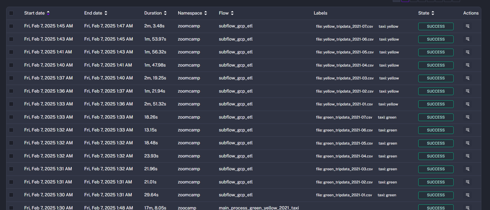
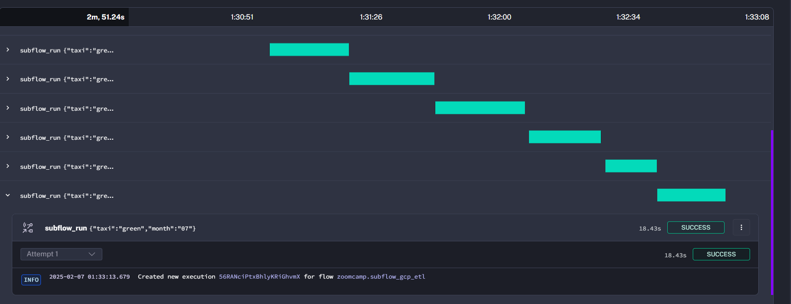

## Utilized Kestra's ForEach looping structure with a precomputation of possible variable-combinations.
### Everything is controlled from  main_flow_gcp_ingestion_green_yellow_2021_taxi.yml.
* Although everything runs in a single ONE flow ,  this is a potentially scalable way to calculate combinations of files without nested loops. Future improvements :  
-persistent json file with conditional check of existence before any attempt to re-run !
- **ForEachItem** for seperate flows per combination (!!!)

